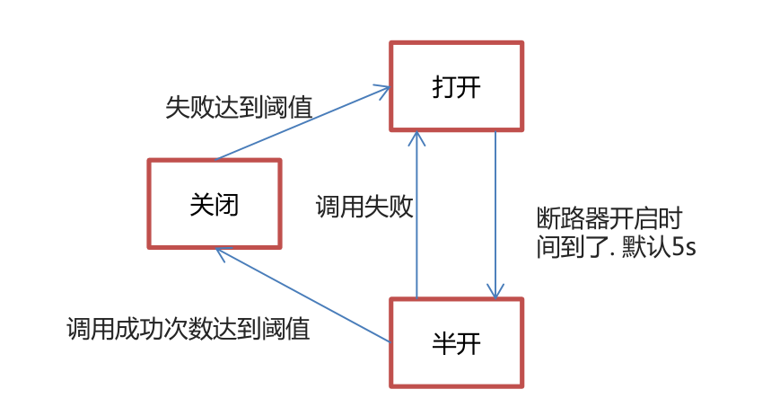

# 	1.今日内容

- Feign 声明式服务调用
- Hystrix 熔断器
- Gateway 网关


# 2.Feign

## 2.1-Feign-概述

• Feign 是一个声明式的 REST 客户端，它用了基于接口的注解方式，很方便实现客户端配置。
• Feign 最初由 Netflix 公司提供，但不支持SpringMVC注解，后由 SpringCloud 对其封装，支持了SpringMVC注
解，让使用者更易于接受


## 2.2-Feign-快速入门


1. 在消费端引入 open-feign 依赖

```xml
   <!--feign-->
        <dependency>
            <groupId>org.springframework.cloud</groupId>
            <artifactId>spring-cloud-starter-openfeign</artifactId>
        </dependency>
```


2. 编写Feign调用接口

```java
package com.itheima.consumer.feign;


import com.itheima.consumer.config.FeignLogConfig;
import com.itheima.consumer.domain.Goods;
import org.springframework.cloud.openfeign.FeignClient;
import org.springframework.web.bind.annotation.GetMapping;
import org.springframework.web.bind.annotation.PathVariable;

/**
 *
 * feign声明式接口。发起远程调用的。
 *
 String url = "http://FEIGN-PROVIDER/goods/findOne/"+id;
 Goods goods = restTemplate.getForObject(url, Goods.class);
 *
 * 1. 定义接口
 * 2. 接口上添加注解 @FeignClient,设置value属性为 服务提供者的 应用名称
 * 3. 编写调用接口，接口的声明规则 和 提供方接口保持一致。
 * 4. 注入该接口对象，调用接口方法完成远程调用
 */
@FeignClient(value = "FEIGN-PROVIDER")
public interface GoodsFeignClient {
    @GetMapping("/goods/findOne/{id}")
    public Goods findGoodsById(@PathVariable("id") int id);
}
```

OrderController

```java
package com.itheima.consumer.controller;


import com.itheima.consumer.domain.Goods;
import com.itheima.consumer.feign.GoodsFeignClient;
import org.springframework.beans.factory.annotation.Autowired;
import org.springframework.web.bind.annotation.GetMapping;
import org.springframework.web.bind.annotation.PathVariable;
import org.springframework.web.bind.annotation.RequestMapping;
import org.springframework.web.bind.annotation.RestController;
import org.springframework.web.client.RestTemplate;

@RestController
@RequestMapping("/order")
public class OrderController {

    @Autowired
    private RestTemplate restTemplate;

    @Autowired
    private GoodsFeignClient goodsFeignClient;

    @GetMapping("/goods/{id}")
    public Goods findGoodsById(@PathVariable("id") int id){

        /*
        String url = "http://FEIGN-PROVIDER/goods/findOne/"+id;
        // 3. 调用方法
        Goods goods = restTemplate.getForObject(url, Goods.class);

        return goods;*/

        Goods goods = goodsFeignClient.findGoodsById(id);

        return goods;
    }


}

```

goodsFeignClient报红，不影响使用


3. 在启动类 添加 @EnableFeignClients 注解，开启Feign功能

```java
package com.itheima.consumer;

import org.springframework.boot.SpringApplication;
import org.springframework.boot.autoconfigure.SpringBootApplication;
import org.springframework.cloud.client.discovery.EnableDiscoveryClient;
import org.springframework.cloud.netflix.eureka.EnableEurekaClient;
import org.springframework.cloud.openfeign.EnableFeignClients;

@EnableDiscoveryClient // 激活DiscoveryClient
@EnableEurekaClient
@SpringBootApplication

@EnableFeignClients //开启Feign的功能
public class ConsumerApp {
    public static void main(String[] args) {
        SpringApplication.run(ConsumerApp.class,args);
    }
}

```

4. 测试调用


## 2.3-Feign超时配置

• Feign 底层依赖于 Ribbon 实现负载均衡和远程调用。
• Ribbon默认1秒超时。
• 超时配置：

feign-consumer  application.yml

```yaml
# 设置Ribbon的超时时间
ribbon:
  ConnectTimeout: 1000 # 连接超时时间 默认1s  默认单位毫秒
  ReadTimeout: 3000 # 逻辑处理的超时时间 默认1s 默认单位毫秒
```


## 2.4-Feign-日志记录

• Feign 只能记录 debug 级别的日志信息。

feign-consumer  application.yml

```yml
# 设置当前的日志级别 debug，feign只支持记录debug级别的日志
logging:
  level:
    com.itheima: debug
```


• 定义Feign日志级别Bean

FeignLogConfig

```java
package com.itheima.consumer.config;
import feign.Logger;
import org.springframework.context.annotation.Bean;
import org.springframework.context.annotation.Configuration;

@Configuration
public class FeignLogConfig {
    /*
        NONE,不记录
        BASIC,记录基本的请求行，响应状态码数据
        HEADERS,记录基本的请求行，响应状态码数据，记录响应头信息
        FULL;记录完成的请求 响应数据
     */
    @Bean
    public Logger.Level level(){
        return Logger.Level.FULL;
    }
}

```


• 启用该Bean：
```java
package com.itheima.consumer.feign;


import com.itheima.consumer.config.FeignLogConfig;
import com.itheima.consumer.domain.Goods;
import org.springframework.cloud.openfeign.FeignClient;
import org.springframework.web.bind.annotation.GetMapping;
import org.springframework.web.bind.annotation.PathVariable;

/**
 *
 * feign声明式接口。发起远程调用的。
 *
 String url = "http://FEIGN-PROVIDER/goods/findOne/"+id;
 Goods goods = restTemplate.getForObject(url, Goods.class);
 *
 * 1. 定义接口
 * 2. 接口上添加注解 @FeignClient,设置value属性为 服务提供者的 应用名称
 * 3. 编写调用接口，接口的声明规则 和 提供方接口保持一致。
 * 4. 注入该接口对象，调用接口方法完成远程调用
 */

@FeignClient(value = "FEIGN-PROVIDER", configuration = FeignLogConfig.class)
public interface GoodsFeignClient {

    @GetMapping("/goods/findOne/{id}")
    public Goods findGoodsById(@PathVariable("id") int id);

}

```


# 3.Hystrix-熔断器

## 3.1-Hystrix-概述

• Hystix 是 Netflix 开源的一个延迟和容错库，用于隔离访问远程服务、第三方库，防止出现级联失败（雪崩）。
• 雪崩：一个服务失败，导致整条链路的服务都失败的情形


**Hystix 主要功能**
• 隔离

​		线程池隔离
​		信号量隔离

• 降级:异常，超时
• 熔断
• 限流


## 3.2-Hystrix-降级

### 3.2.1-提供方降级

Hystix 降级：当服务发生异常或调用超时，返回默认数据

服务提供方降级

1. 在服务提供方，引入 hystrix 依赖

   ```xml
           <!-- hystrix -->
            <dependency>
                <groupId>org.springframework.cloud</groupId>
                <artifactId>spring-cloud-starter-netflix-hystrix</artifactId>
            </dependency>
   ```

   

2. 定义降级方法

```java
 /**
     * 定义降级方法：
     *  1. 方法的返回值需要和原方法一样
     *  2. 方法的参数需要和原方法一样
     */
    public Goods findOne_fallback(int id){
        Goods goods = new Goods();
        goods.setTitle("降级了~~~");

        return goods;
    }
```


3. 使用 @HystrixCommand 注解配置降级方法

```java
/**
     * 降级：
     *  1. 出现异常
     *  2. 服务调用超时
     *      * 默认1s超时
     *
     *  @HystrixCommand(fallbackMethod = "findOne_fallback")
     *      fallbackMethod：指定降级后调用的方法名称
     */
    @GetMapping("/findOne/{id}")
    @HystrixCommand(fallbackMethod = "findOne_fallback",commandProperties = {
            //设置Hystrix的超时时间，默认1s
 @HystrixProperty(name="execution.isolation.thread.timeoutInMilliseconds",value = "3000")
    })
    public Goods findOne(@PathVariable("id") int id){

        //1.造个异常
        int i = 3/0;
        try {
            //2. 休眠2秒
            Thread.sleep(2000);
        } catch (InterruptedException e) {
            e.printStackTrace();
        }
        Goods goods = goodsService.findOne(id);

        goods.setTitle(goods.getTitle() + ":" + port);//将端口号，设置到了 商品标题上
        return goods;
    }
```


4. 在启动类上开启Hystrix功能：@EnableCircuitBreaker

```java
package com.itheima.provider;

import org.springframework.boot.SpringApplication;
import org.springframework.boot.autoconfigure.SpringBootApplication;
import org.springframework.cloud.client.circuitbreaker.EnableCircuitBreaker;
import org.springframework.cloud.netflix.eureka.EnableEurekaClient;

/**
 * 启动类
 */
@EnableEurekaClient //该注解 在新版本中可以省略
@SpringBootApplication
@EnableCircuitBreaker // 开启Hystrix功能
public class ProviderApp {
    public static void main(String[] args) {
        SpringApplication.run(ProviderApp.class,args);
    }
}

```


### 3.2.2-消费方降级

1. feign 组件已经集成了 hystrix 组件。

2. 定义feign 调用接口实现类，复写方法，即 降级方法

   GoodsFeignClientFallback

```java
package com.itheima.consumer.feign;

import com.itheima.consumer.domain.Goods;
import org.springframework.stereotype.Component;

/**
 * Feign 客户端的降级处理类
 * 1. 定义类 实现 Feign 客户端接口
 * 2. 使用@Component注解将该类的Bean加入SpringIOC容器
 */
@Component
public class GoodsFeignClientFallback implements GoodsFeignClient {
    @Override
    public Goods findGoodsById(int id) {
        Goods goods = new Goods();
        goods.setTitle("又被降级了~~~");
        return goods;
    }
}

```


3. 在 @FeignClient 注解中使用 fallback 属性设置降级处理类。

   GoodsFeignClient

```java
package com.itheima.consumer.feign;


import com.itheima.consumer.domain.Goods;
import org.springframework.cloud.openfeign.FeignClient;
import org.springframework.web.bind.annotation.GetMapping;
import org.springframework.web.bind.annotation.PathVariable;

@FeignClient(value = "HYSTRIX-PROVIDER",fallback = GoodsFeignClientFallback.class)
public interface GoodsFeignClient {
    @GetMapping("/goods/findOne/{id}")
    public Goods findGoodsById(@PathVariable("id") int id);

}

```


4. 配置开启 feign.hystrix.enabled = true

   application.yml

```yaml
# 开启feign对hystrix的支持
feign:
  hystrix:
    enabled: true
```


## 3.3-Hystrix-熔断

### 3.3.1-熔断-概念

• Hystrix 熔断机制，用于监控微服务调用情况，当失败的情况达到预定的阈值（5秒失败20次），会打开
断路器，拒绝所有请求，直到服务恢复正常为止。

断路器三种状态：打开、半开、关闭、





### 3.3.2-熔断-代码演示

修改服务提供方的方法，演示熔断机制

熔断配置

• circuitBreaker.sleepWindowInMilliseconds：监控时间
• circuitBreaker.requestVolumeThreshold：失败次数
• circuitBreaker.errorThresholdPercentage：失败率


GoodsController

```java
package com.itheima.provider.controller;

import com.itheima.provider.domain.Goods;
import com.itheima.provider.service.GoodsService;
import com.netflix.hystrix.contrib.javanica.annotation.HystrixCommand;
import com.netflix.hystrix.contrib.javanica.annotation.HystrixProperty;
import org.springframework.beans.factory.annotation.Autowired;
import org.springframework.beans.factory.annotation.Value;
import org.springframework.web.bind.annotation.GetMapping;
import org.springframework.web.bind.annotation.PathVariable;
import org.springframework.web.bind.annotation.RequestMapping;
import org.springframework.web.bind.annotation.RestController;

import java.util.Date;

/**
 * Goods Controller 服务提供方
 */

@RestController
@RequestMapping("/goods")
public class GoodsController {

    @Autowired
    private GoodsService goodsService;

    @Value("${server.port}")
    private int port;

    /**
     * 降级：
     *  1. 出现异常
     *  2. 服务调用超时
     *      * 默认1s超时
     *
     *  @HystrixCommand(fallbackMethod = "findOne_fallback")
     *      fallbackMethod：指定降级后调用的方法名称
     */

 @GetMapping("/findOne/{id}")
@HystrixCommand(fallbackMethod = "findOne_fallback",commandProperties = {
         //设置Hystrix的超时时间，默认1s
@HystrixProperty(name="execution.isolation.thread.timeoutInMilliseconds",value = "3000"),
            //监控时间 默认5000 毫秒
@HystrixProperty(name="circuitBreaker.sleepWindowInMilliseconds",value = "5000"),
            //失败次数。默认20次
 @HystrixProperty(name="circuitBreaker.requestVolumeThreshold",value = "20"),
            //失败率 默认50%
 @HystrixProperty(name="circuitBreaker.errorThresholdPercentage",value = "50") })
    public Goods findOne(@PathVariable("id") int id){
        //如果id == 1 ，则出现异常，id != 1 则正常访问
        if(id == 1){
            //1.造个异常
            int i = 3/0;
        }
        /*try {
            //2. 休眠2秒
            Thread.sleep(2000);
        } catch (InterruptedException e) {
            e.printStackTrace();
        }*/
        Goods goods = goodsService.findOne(id);

        goods.setTitle(goods.getTitle() + ":" + port);//将端口号，设置到了 商品标题上
        return goods;
    }


    /**
     * 定义降级方法：
     *  1. 方法的返回值需要和原方法一样
     *  2. 方法的参数需要和原方法一样
     */
    public Goods findOne_fallback(int id){
        Goods goods = new Goods();
        goods.setTitle("降级了~~~");

        return goods;
    }

}

```


### 3.3.3-熔断监控


• Hystrix 提供了 Hystrix-dashboard 功能，用于实时监控微服务运行状态。
• 但是Hystrix-dashboard只能监控一个微服务。
• Netflix 还提供了 Turbine ，进行聚合监控。


熔断器监控安装  请查看**Turbine搭建步骤.md**


# 4.Gateway

## 4.1-Gateway-概述

- 网关旨在为微服务架构提供一种简单而有效的统一的API路由管理方式。


- 在微服务架构中，不同的微服务可以有不同的网络地址，各个微服务之间通过互相调用完成用户请求，客户端可能通过调用N个微服务的接口完成一个用户请求。


- 存在的问题：

```
	1.客户端多次请求不同的微服务，增加客户端的复杂性
	2.认证复杂，每个服务都要进行认证
	3.http请求不同服务次数增加，性能不高
```

-  网关就是系统的入口，封装了应用程序的内部结构，为客户端提供统一服务，一些与业务本身功能无关的公共逻辑可以在这里实现，诸如认证、鉴权、监控、缓存、负载均衡、流量管控、路由转发等

- 在目前的网关解决方案里，有Nginx+ Lua、Netflix Zuul 、Spring Cloud Gateway等等


## 4.2-Gateway-快速入门


1. 搭建网关模块

   创建api-gateway-server模块

   

2. 引入依赖：starter-gateway

   ```xml
    <dependencies>
           <!--引入gateway 网关-->
           <dependency>
               <groupId>org.springframework.cloud</groupId>
               <artifactId>spring-cloud-starter-gateway</artifactId>
           </dependency>
           <!-- eureka-client -->
           <dependency>
               <groupId>org.springframework.cloud</groupId>
               <artifactId>spring-cloud-starter-netflix-eureka-client</artifactId>
           </dependency>
       </dependencies>
   ```
   
   

3. 编写启动类

   ```java
   package com.itheima.gateway;
   
   import org.springframework.boot.SpringApplication;
   import org.springframework.boot.autoconfigure.SpringBootApplication;
   import org.springframework.cloud.netflix.eureka.EnableEurekaClient;
   
   @SpringBootApplication
   @EnableEurekaClient
   public class ApiGatewayApp {
   
       public static void main(String[] args) {
           SpringApplication.run(ApiGatewayApp.class,args);
       }
   
   }
   
   ```

   

4. 编写配置文件

   application.yml

   ```yml
   server:
     port: 80
   
   spring:
     application:
       name: api-gateway-server
   
     cloud:
       # 网关配置
       gateway:
         # 路由配置：转发规则
         routes: #集合。
         # id: 唯一标识。默认是一个UUID
         # uri: 转发路径
         # predicates: 条件,用于请求网关路径的匹配规则
   
   
         - id: gateway-provider
           uri: http://localhost:8001/
           predicates:
           - Path=/goods/**
   ```

   

5. 启动测试

## 4.3-Gateway-静态路由

application.yml  中的uri是写死的，就是静态路由

```yml
server:
  port: 80

spring:
  application:
    name: api-gateway-server

  cloud:
    # 网关配置
    gateway:
      # 路由配置：转发规则
      routes: #集合。
      # id: 唯一标识。默认是一个UUID
      # uri: 转发路径
      # predicates: 条件,用于请求网关路径的匹配规则
      # filters：配置局部过滤器的
      - id: gateway-provider
        # 静态路由
        uri: http://localhost:8001/
        predicates:
        - Path=/goods/**
```

## 4.4-Gateway-动态路由

启动类添加@EnableEurekaClient（新版本不加也可以）

```java
package com.itheima.gateway;

import org.springframework.boot.SpringApplication;
import org.springframework.boot.autoconfigure.SpringBootApplication;
import org.springframework.cloud.netflix.eureka.EnableEurekaClient;

@SpringBootApplication
@EnableEurekaClient
public class ApiGatewayApp {

    public static void main(String[] args) {
        SpringApplication.run(ApiGatewayApp.class,args);
    }

}
```


 引入eureka-client配置

application.yml  中修改uri属性：uri: lb://服务名称

```yml
server:
  port: 80

spring:
  application:
    name: api-gateway-server

  cloud:
    # 网关配置
    gateway:
      # 路由配置：转发规则
      routes: #集合。
      # id: 唯一标识。默认是一个UUID
      # uri: 转发路径
      # predicates: 条件,用于请求网关路径的匹配规则
      # filters：配置局部过滤器的

      - id: gateway-provider
      	# 静态路由
        # uri: http://localhost:8001/
        # 动态路由
        uri: lb://GATEWAY-PROVIDER
        predicates:
        - Path=/goods/**
```

## 4.5-Gateway-微服务名称配置


application.yml中配置微服务名称配置

```yaml
      # 微服务名称配置
      discovery:
        locator:
          enabled: true # 设置为true 请求路径前可以添加微服务名称
          lower-case-service-id: true # 允许为小写
```

## 4.6-Gateway-过滤器

### 4.6.1-过滤器-概述

-  Gateway 支持过滤器功能，对请求或响应进行拦截，完成一些通用操作。

-  Gateway 提供两种过滤器方式：“pre”和“post”

   ​      **pre 过滤器**，在转发之前执行，可以做参数校验、权限校验、流量监控、日志输出、协议转换等。
   ​      **post 过滤器**，在响应之前执行，可以做响应内容、响应头的修改，日志的输出，流量监控等。

  

-  Gateway 还提供了两种类型过滤器
             **GatewayFilter**：局部过滤器，针对单个路由
             **GlobalFilter** ：全局过滤器，针对所有路由


### 4.6.2-局部过滤器

-  GatewayFilter 局部过滤器，是针对单个路由的过滤器。
- 在Spring Cloud Gateway 组件中提供了大量内置的局部过滤器，对请求和响应做过滤操作。
- 遵循约定大于配置的思想，只需要在配置文件配置局部过滤器名称，并为其指定对应的值，就可以让其生效。


具体配置参见**gateway内置过滤器工厂.md**


测试配置

api-gateway-server   application.yml

```yaml
server:
  port: 80
spring:
  application:
    name: api-gateway-server
  cloud:
    # 网关配置
    gateway:
      # 路由配置：转发规则
      routes: #集合。
      # id: 唯一标识。默认是一个UUID
      # uri: 转发路径
      # predicates: 条件,用于请求网关路径的匹配规则
      # filters：配置局部过滤器的

      - id: gateway-provider
        # 静态路由
        # uri: http://localhost:8001/
        # 动态路由
        uri: lb://GATEWAY-PROVIDER
        predicates:
        - Path=/goods/**
        filters:
        - AddRequestParameter=username,zhangsan
```

gateway-provider模块中GoodsController中的findOne添加username参数

```java
 public Goods findOne(@PathVariable("id") int id,String username){

        System.out.println(username);

        //如果id == 1 ，则出现异常，id != 1 则正常访问
        if(id == 1){
            //1.造个异常
            int i = 3/0;
        }

        /*try {
            //2. 休眠2秒
            Thread.sleep(2000);
        } catch (InterruptedException e) {
            e.printStackTrace();
        }*/
        Goods goods = goodsService.findOne(id);

        goods.setTitle(goods.getTitle() + ":" + port);//将端口号，设置到了 商品标题上
        return goods;
    }
```


### 4.6.3-全局过滤器

- GlobalFilter 全局过滤器，不需要在配置文件中配置，系统初始化时加载，并作用在每个路由上。
- Spring Cloud Gateway 核心的功能也是通过内置的全局过滤器来完成。
- 自定义全局过滤器步骤：

   1. 定义类实现 GlobalFilter 和 Ordered接口
   2. 复写方法
   3. 完成逻辑处理


MyFilter

```java
package com.itheima.gateway.filter;

import org.springframework.cloud.gateway.filter.GatewayFilterChain;
import org.springframework.cloud.gateway.filter.GlobalFilter;
import org.springframework.core.Ordered;
import org.springframework.stereotype.Component;
import org.springframework.web.server.ServerWebExchange;
import reactor.core.publisher.Mono;

@Component
public class MyFilter implements GlobalFilter, Ordered {
    @Override
    public Mono<Void> filter(ServerWebExchange exchange, GatewayFilterChain chain) {

        System.out.println("自定义全局过滤器执行了~~~");

        return chain.filter(exchange);//放行
    }

    /**
     * 过滤器排序
     * @return 数值越小 越先执行
     */
    @Override
    public int getOrder() {
        return 0;
    }
}

```


## 4.7 通过feign调用spring cloud gateway代理的服务


### 4.7.1工程结构

工程搭建参考代码目录`SpringCloud\day02\代码\3. Gateway\2. gateway最终代码`

* api-gateway-server  80端口
* eureka-server-gateway  8761端口
* gateway-consumer 9000端口
* gateway-provider 8001端口

### 4.7.2 配置consumer通过gateway调用provider

> 修改feign接口上FeignClient注解的value值为api-gateway-server的应用名称

```java
package com.itheima.consumer.feign;


import com.itheima.consumer.domain.Goods;
import org.springframework.cloud.openfeign.FeignClient;
import org.springframework.web.bind.annotation.GetMapping;
import org.springframework.web.bind.annotation.PathVariable;


@FeignClient(value = "api-gateway-server",fallback = GoodsFeignClientFallback.class)
public interface GoodsFeignClient {


    @GetMapping("/goods/findOne/{id}")
    public Goods findGoodsById(@PathVariable("id") int id);

}

```

### 4.7.3 调用方式

* 访问eureka
  * http://localhost:8761/
* 访问消费者
  * 使用非网关的方式 http://localhost:9000/order/goods/2
  * 使用网关不配置微服务名称的方式 http://localhost/order/goods/2
  * 使用网关配置微服务名称的方式 http://localhost/gateway-consumer/order/goods/2
* 访问生产者
  * 使用非网关的方式 http://localhost:8001/goods/findOne/2
  * 使用网关不配置微服务名的方式 http://localhost/goods/findOne/2
  * 使用网关配置微服务名称的方式 http://localhost/gateway-provider/goods/findOne/2


